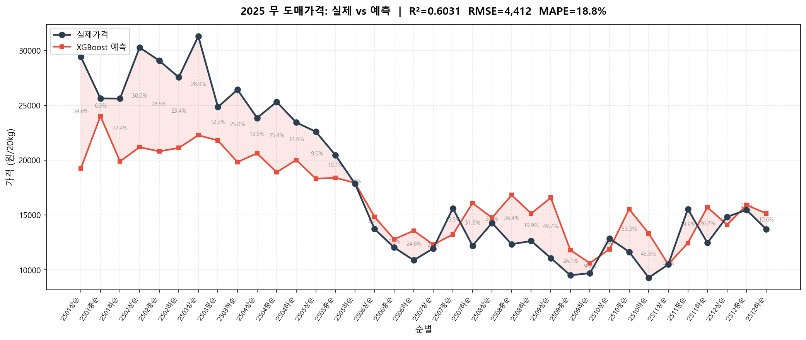
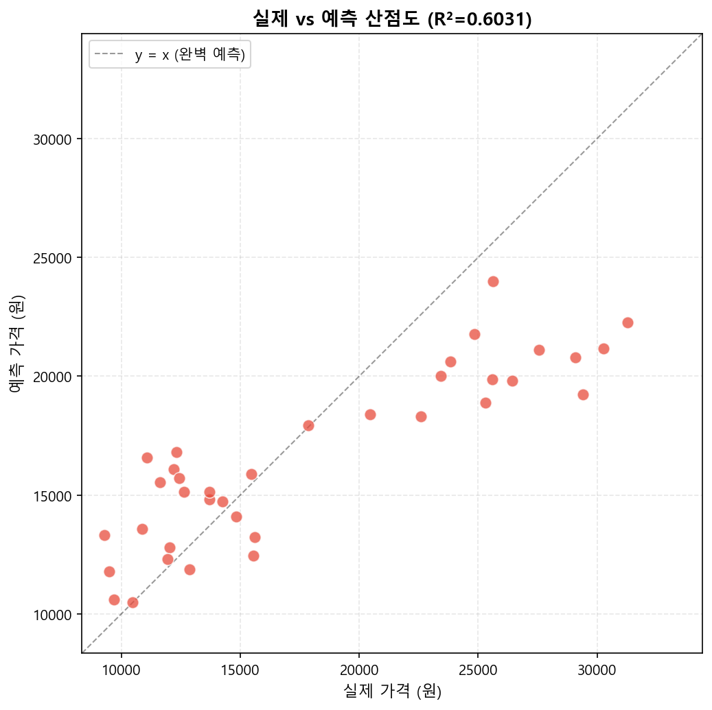
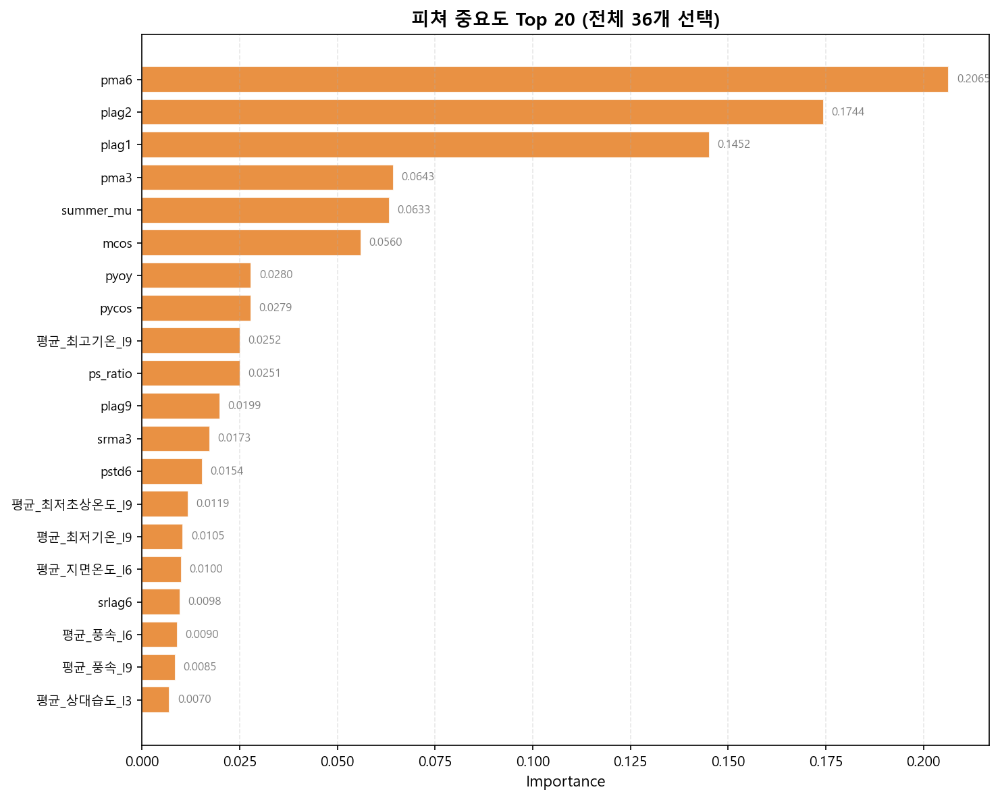
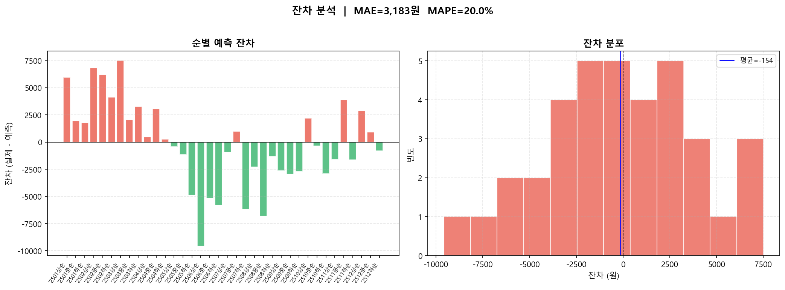
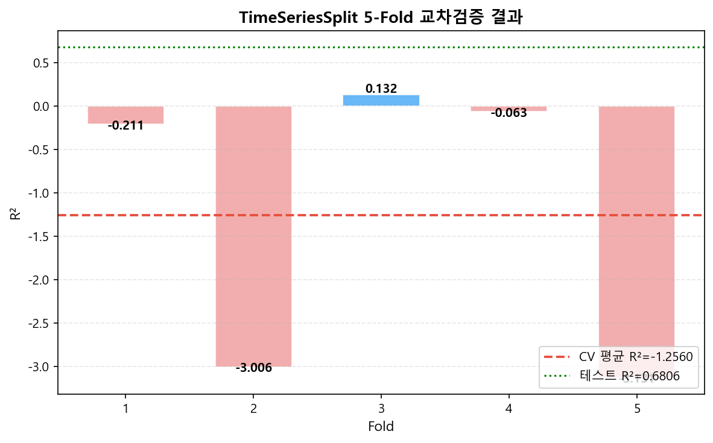

# 무 도매 평균가격 순별 예측 모델
XGBoost 기반 머신러닝을 활용하여 무 도매 평균가격을 순별(상순/중순/하순) 단위로 예측하는 모델입니다.

## 1. 프로젝트 개요
가격, 기상, 반입량, 검색량 등 다양한 데이터 소스를 활용하여 무 도매가격의 단기 예측 모델을 구축합니다.

* **학습 기간:** 2018~2024년
* **테스트 기간:** 2025년
* **예측 단위:** 순별 (월 3회: 상순/중순/하순)

## 2. 데이터
| 데이터 | 파일명 | 주요 변수 | 출처 |
|---|---|---|---|
| 가격 | 가격데이터_순별.csv | 평균가격, 전년가, 평년가 | 농산물유통정보 (KAMIS) |
| 겨울무 기상 | 성산_순별.csv | 기온, 강수량, 일사량 등 8개 | 기상청 (제주 성산) |
| 봄/가을무 기상 | 고창군_순별.csv | 기온, 강수량, 일사량 등 8개 | 기상청 |
| 여름무 기상 | 대관령_순별.csv | 기온, 강수량, 일사량 등 8개 | 기상청 |
| 반입량 | 무반입량_순별.csv | 총반입량 | 농산물유통정보 |
| 검색량 | search_순별.csv | 평균 검색량 | 네이버 데이터랩 |

### 기상 데이터 활용 규칙
무의 재배 시기 및 주산지가 계절에 따라 다른 점을 반영하여 기상 데이터를 조건부 병합합니다.

* **12~2월 (겨울무):** 성산 기상 데이터 사용 (제주 월동무 주산지)
* **3~6월 (봄무):** 고창군 기상 데이터 사용
* **7~8월 (여름무):** 대관령 기상 데이터 사용 (고랭지)
* **9~11월 (가을무):** 고창군 기상 데이터 사용

## 3. 방법론
### 3.1 피쳐 엔지니어링
총 다양한 후보 피쳐를 생성하며, importance 기반으로 핵심 36개의 피쳐를 선별합니다.

| 카테고리 | 주요 피쳐 | 설명 |
|---|---|---|
| 가격 시계열 | plag1, plag6, pma3, pma12, pstd6 | lag, 이동평균, 변동성 |
| 가격 파생 | pmom3, pyoy, p_vs_py, p_vs_jn | 모멘텀, 전년대비 비율, 평년대비 비율 등 |
| 반입량 | slag3, sma6, ps_ratio | lag, 이동평균, 가격/반입 비율 |
| 검색량 | srlag6 | lag |
| 기상 | 평균_최고기온_l1/l3, 평균_지면온도_l1/l6 등 | 8개 기상변수 × 여러 시차(l1, l3, l6, l9 등) |
| 달력/계절 변수 | msin, mcos, pysin, summer_mu | 계절/연주기 순환성 인코딩 |

### 3.2 모델
* **알고리즘:** XGBoost (Gradient Boosted Trees)
* **하이퍼파라미터:** `n_estimators=500`, `max_depth=3`, `learning_rate=0.05`
* **평가 방법:** TimeSeriesSplit 5-Fold 교차검증 + 2025년 Hold-out 테스트

## 4. 결과
### 4.1 성능 지표
| 지표 | 테스트 (2025) | CV 평균 |
|---|---|---|
| R² | 0.68 | -1.26 |
| RMSE | 3,958 | 4,174 |
| MAPE | 20.02% | - |

> **CV 평균이 낮은 이유:** 
> TimeSeriesSplit 특성상 Fold마다 편차가 있으며, 특히 특정기간(COVID 시기 등) 가격 급변의 이례적인 시점이 포함된 Fold(ex: Fold 2)에서 예측력이 떨어지는 구간이 존재하여 전체 CV 평균이 다소 낮게 나타났습니다. 2025년 테스트 결과는 비교적 안정적입니다.

### 4.2 2025년 예측 결과

2025년 순별 실제가격과 예측가격을 비교한 시계열 그래프입니다. 오차율이 함께 표시됩니다.

### 4.3 실제 vs 예측 산점도

2025년 테스트 데이터에서 실제값과 예측값의 상관 분포를 산점도로 확인합니다. 대각선에 가까울수록 정확도가 높음을 의미합니다.

### 4.4 피쳐 중요도

단기 이동평균(`pma3`, `pma6`) 및 직전 가격(`plag2`, `plag1`), 전/평년 관련 피쳐(`pyoy`, 계절성 변수 `mcos`, `pycos`, `summer_mu`)가 중요하게 반영되었습니다. V3 업데이트 이후 기상 및 검색량(srma3, srlag 등) 파생 변수들도 모델 성능에 기여하고 있습니다. 

### 4.5 전체 시계열

2018~2025년 전체 기간의 데이터 및 모델의 Fitting 현황을 비교합니다. 가장 우측 라인 바깥 영역이 2025년 Test 셋 영역입니다.

### 4.6 잔차 분석

모델의 잔차(Residual) 분포 및 자기상관(ACF)을 검토하여 예측 모델의 잔차가 특정 패턴없이 백색잡음에 가까운 형태인지 확인합니다.

### 4.7 교차검증 결과

시점에 따른 5개 TimeSeries Fold별 R² 및 RMSE 평가 변화입니다. 특정 년도에서는 RMSE가 확 증가하거나 예측오차가 커지는 경향을 확인할 수 있습니다.
